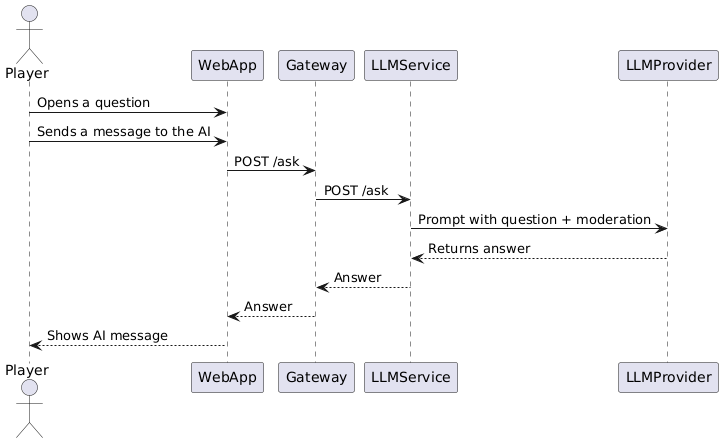

ifndef::imagesdir[:imagesdir: ../images]

[[section-runtime-view]]
== Runtime View

The Runtime View illustrates how the different components of the system interact at runtime to fulfill specific use cases. It focuses on the dynamic behavior of the system, describing the communication between the frontend, gateway, and backend microservices. Each diagram represents a specific user action or system event, highlighting the sequence of requests, validations, and data flows involved.

These diagrams help clarify how responsibilities are distributed across services and how data moves through the architecture during key operations such as user registration, login, password changes, and question generation.

==== User Registration

==== User Login

==== Question Generation

==== Answering a Question

==== Ask for a hint to the AI Chat

==== User Password Change

ifdef::arc42help[]
[role="arc42help"]
****
.Contents
The runtime view describes concrete behavior and interactions of the system’s building blocks in form of scenarios from the following areas:

* important use cases or features: how do building blocks execute them?
* interactions at critical external interfaces: how do building blocks cooperate with users and neighboring systems?
* operation and administration: launch, start-up, stop
* error and exception scenarios

Remark: The main criterion for the choice of possible scenarios (sequences, workflows) is their *architectural relevance*. It is *not* important to describe a large number of scenarios. You should rather document a representative selection.

.Motivation
You should understand how (instances of) building blocks of your system perform their job and communicate at runtime.
You will mainly capture scenarios in your documentation to communicate your architecture to stakeholders that are less willing or able to read and understand the static models (building block view, deployment view).

.Form
There are many notations for describing scenarios, e.g.

* numbered list of steps (in natural language)
* activity diagrams or flow charts
* sequence diagrams
* BPMN or EPCs (event process chains)
* state machines
* ...

.Further Information

See https://docs.arc42.org/section-6/[Runtime View] in the arc42 documentation.

Esto es lo que estaba escrito antes:

=== <Runtime Scenario 1>

* _<insert runtime diagram or textual description of the scenario>_
* _<insert description of the notable aspects of the interactions between the
building block instances depicted in this diagram.>_

It is possible to use a sequence diagram:

[plantuml,"Sequence diagram",png]
----
actor Alice
actor Bob
database Pod as "Bob's Pod"
Alice -> Bob: Authentication Request
Bob --> Alice: Authentication Response
Alice  --> Pod: Store route
Alice -> Bob: Another authentication Request
Alice <-- Bob: another authentication Response
----

=== <Runtime Scenario 2>

=== ...

=== <Runtime Scenario n>

****
endif::arc42help[]

